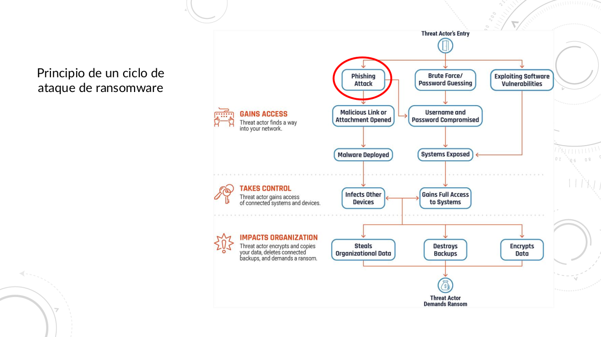

# Ransomware

Ransomware es un tipo de malware que cifra los archivos de la víctima y pide un rescate a cambio de la clave de descifrado. Este tipo de malware es muy peligroso y puede causar grandes pérdidas de datos.

